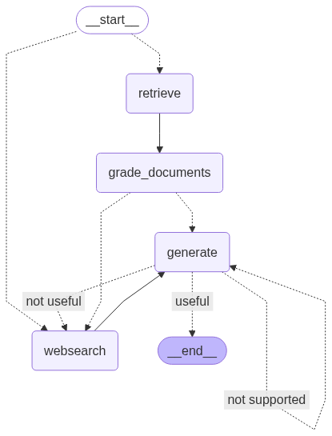

# Advanced RAG Pipeline (LangGraph + Chroma)

> Repository: **Advance-RAG-Project**
> GitHub: [https://github.com/etemesaysarac/Advance-RAG-Project/tree/main](https://github.com/etemesaysarac/Advance-RAG-Project/tree/main)

[](https://www.python.org/)
[](https://langchain-ai.github.io/langgraph/)
[](https://python.langchain.com/)
[](https://docs.trychroma.com/)
[](https://docs.tavily.com/)
[](https://platform.openai.com/)
[](https://docs.pytest.org/)
[](#license)

---

## Abstract

This repository implements a **self-correcting Retrieval-Augmented Generation (RAG)** system orchestrated with **LangGraph**. A user query is **routed** to either the local **vector store** (Chroma) or **web search** (Tavily). Retrieved context is **graded** for relevance; answers are generated with an LLM and then **double-checked** by two independent graders:

1. **Generation vs. Documents** (hallucination control)
2. **Generation vs. Question** (does it actually answer?)

If the answer is unsupported or unhelpful, the graph **loops** to enrich context (web search) and/or **re-generate**, yielding a robust, production‑oriented RAG pipeline.

---

## Demonstration Query (exact prompt)

> **Used in `main.py`:**
>
> `"What is Automatic Prompt Design?"`

This prompt is visible in the quick‑start example below and drives the sample run/screen captures.

---

## Architecture Overview

* **Routing:** `graph/chains/router.py` classifies the query to `vectorstore` (for agent / prompt‑engineering / adversarial‑LLM topics) or `websearch` for everything else.
* **Retrieval:** `graph/nodes/retrieve.py` fetches context from **Chroma**, persisted locally at `./.chroma`.
* **Document Grading:** `graph/nodes/grade_documents.py` filters irrelevant chunks via an LLM‑based relevance grader. If irrelevant content is detected, it flips a `web_search` flag.
* **Web Search:** `graph/nodes/web_search.py` enriches context with Tavily results.
* **Generation:** `graph/nodes/generate.py` produces an answer using the Hub prompt `rlm/rag-prompt` + OpenAI chat model.
* **Answer Validation:**

  * **Hallucination:** `graph/chains/hallucination_grader.py` checks if the answer is grounded in the retrieved facts.
  * **Helpfulness:** `graph/chains/answer_grader.py` checks whether the answer resolves the question.
* **Graph Control:** `graph/graph.py` encodes conditional entry, conditional edges, and termination criteria.

**High‑level flow (Mermaid):**




---

## Repository Tree (expanded)

```text
Advance_RAG_Project/
├─ .chroma/                                # Persistent Chroma collection (rag-chroma)
│   └─ ...                                  # Auto-generated; do not edit manually
├─ Assets/                                  # Visuals used in README & docs
│   ├─ graph.png
│   ├─ LANGRAPH_structure.png
│   ├─ app_LANGRAPH_structure.png
│   ├─ question1_1.png
│   ├─ question1_2.png
│   ├─ question2_1.png
│   ├─ question2_2.png
│   ├─ question2_3.png
│   └─ web_search.png
├─ graph/
│   ├─ chains/                              # Router & Graders (LLM-based)
│   │   ├─ answer_grader.py                 # Generation ↔ Question (yes/no)
│   │   ├─ generation.py                    # Hub prompt + ChatOpenAI + StrOutputParser
│   │   ├─ hallucination_grader.py          # Generation ↔ Documents (yes/no)
│   │   ├─ retrieval_grader.py              # Document ↔ Question (yes/no)
│   │   └─ router.py                        # RouteQuery(schema) → vectorstore | websearch
│   ├─ nodes/                               # Executable nodes used by the graph
│   │   ├─ __init__.py                      # Re-exports generate, grade_documents, retrieve, web_search
│   │   ├─ generate.py                      # LLM generation using generation_chain
│   │   ├─ grade_documents.py               # Relevance filtering + web_search flag
│   │   ├─ retrieve.py                      # Chroma retriever invocation
│   │   └─ web_search.py                    # TavilySearchResults (k=3) → enrich documents
│   ├─ graph.py                             # StateGraph: nodes, edges, conditional routing, END
│   ├─ node_constants.py                    # Node names (RETRIEVE, GENERATE, WEBSEARCH, GRADE_DOCUMENTS)
│   └─ state.py                             # GraphState (TypedDict): question, generation, web_search, documents
├─ ingestion.py                              # Web ingestion → split → embed → persist to Chroma
├─ main.py                                   # Example entrypoint (app.invoke)
├─ requirements.txt                          # Pinned libs
└─ .env                                      # Local secrets (NOT committed)
```

---

## Installation

```bash
git clone https://github.com/etemesaysarac/Advance-RAG-Project.git
cd Advance-RAG-Project

python -m venv .venv
# Windows:
.venv\Scripts\activate
# macOS/Linux:
source .venv/bin/activate

pip install -r requirements.txt
```

**Python requirement:** 3.11+

---

## Configuration (.env)

Create a `.env` file at the project root (do **not** commit it):

```dotenv
OPENAI_API_KEY="your_openai_key"
LANGCHAIN_API_KEY="your_langsmith_key"
LANGCHAIN_TRACING_V2=true
LANGCHAIN_PROJECT=your_project_name
TAVILY_API_KEY="your_tavily_key"
# Optional: PYTHONPATH only if you need custom module resolution
# PYTHONPATH=/absolute/path/to/Advance_RAG_Project
```

Notes:

* `LANGCHAIN_TRACING_V2=true` with `LANGCHAIN_PROJECT` enables LangSmith tracing.
* `TAVILY_API_KEY` is used by `TavilySearchResults` in `web_search.py`.

---

## Data Ingestion & Indexing

**Script:** `ingestion.py`

1. **Sources:** three posts by Lilian Weng (agents, prompt engineering, adversarial attacks).
2. **Chunking:** `RecursiveCharacterTextSplitter` with `chunk_size=250`, `chunk_overlap=0`.
3. **Embeddings:** `OpenAIEmbeddings()`.
4. **Persistence:** Chroma `collection_name="rag-chroma"` at `./.chroma`.

Run:

```bash
python ingestion.py
```

This builds a **persistent** local vector store reused across runs.

---

## Quick Start (runs the demonstration query)

`main.py` uses the exact prompt shown above:

```python
from dotenv import load_dotenv
from graph.graph import app

load_dotenv()

if __name__ == "__main__":
    print("Hello Advanced RAG")
    print(app.invoke(input={"question": "What is Automatic Prompt Design?"}))
```

Execute:

```bash
python main.py
```

Expected console (truncated):

```text
Hello Advanced RAG
{ "generation": "Automatic Prompt Design is ...", "documents": [...], ... }
```

---

## Graph State & Contracts

`graph/state.py` defines the shared state:

```python
from typing import List, TypedDict
# Prefer: from langchain.schema import Document

class GraphState(TypedDict):
    question: str                # user query
    generation: str              # final LLM output
    web_search: bool             # whether to branch to web search
    documents: List[Document]    # retrieved / enriched context
```

---

## Nodes

| Node              | File                             | Purpose                                       | Input → Output                                             |
| :---------------- | :------------------------------- | :-------------------------------------------- | :--------------------------------------------------------- |
| `RETRIEVE`        | `graph/nodes/retrieve.py`        | Retrieve context from Chroma retriever        | `question` → `documents`                                   |
| `GRADE_DOCUMENTS` | `graph/nodes/grade_documents.py` | Filter irrelevant docs; set `web_search` flag | `question, documents` → `documents (filtered), web_search` |
| `WEBSEARCH`       | `graph/nodes/web_search.py`      | Enrich context with Tavily results            | `question, documents?` → `documents (enriched)`            |
| `GENERATE`        | `graph/nodes/generate.py`        | Produce the answer with LLM                   | `question, documents` → `generation`                       |

Implementation notes:

* **Retrieve:** imports `retriever` from `ingestion.py`.
* **Web Search:** currently concatenates Tavily results into **one** `Document`. For finer‑grained citations, keep them separate and use `Document.metadata["source"]`.
* **Generate:** uses `hub.pull("rlm/rag-prompt")` + `ChatOpenAI(temperature=0)` + `StrOutputParser()`.

---

## Chains (Router & Graders)

| Chain                    | File                                   | Purpose                                     | Return                                                 |        |
| :----------------------- | :------------------------------------- | :------------------------------------------ | :----------------------------------------------------- | ------ |
| **Router**               | `graph/chains/router.py`               | Route query to `vectorstore` or `websearch` | `RouteQuery(datasource ∈ {"vectorstore","websearch"})` |        |
| **Retrieval Grader**     | `graph/chains/retrieval_grader.py`     | Document ↔ Question relevance               | \`binary\_score: "yes"                                 | "no"\` |
| **Hallucination Grader** | `graph/chains/hallucination_grader.py` | Generation ↔ Documents grounding            | `binary_score: bool` (True → grounded)                 |        |
| **Answer Grader**        | `graph/chains/answer_grader.py`        | Generation ↔ Question helpfulness           | `binary_score: bool` (True → addresses question)       |        |
| **Generation Chain**     | `graph/chains/generation.py`           | Prompt + LLM assembly                       | `str` (final text)                                     |        |

Decision logic resides in `graph/graph.py`:

* **Entry:** conditional routing via `route_question()` → `WEBSEARCH` or `RETRIEVE`.
* **After retrieval:** `GRADE_DOCUMENTS` then conditional edge → `WEBSEARCH` or `GENERATE` by `decide_to_generate()`.
* **After generation:** conditional edge via `grade_generation_grounded_in_documents_and_question()` → `"not supported"` → loop to `GENERATE` (hallucination), `"not useful"` → branch to `WEBSEARCH`, `"useful"` → `END`.

---

## Screenshots (runtime)

> The following captures were taken from actual runs and placed under `Assets/`.

**Figure A — Sample QA run**


**Figure B — Query Routing & Self-Correcting RAG Flow**


> If your filenames differ, adjust the relative paths accordingly.

---

## Testing

Minimal smoke test (requires keys in `.env` and a populated Chroma store):

```python
# tests/test_pipeline.py
from dotenv import load_dotenv
from graph.graph import app

def test_app_invoke_smoke():
    load_dotenv()
    out = app.invoke(input={"question": "What is Automatic Prompt Design?"})
    assert out is not None
    assert "generation" in out or "documents" in out
```

Run:

```bash
pytest -q
```

---

## Reproducibility & Observability

* **Determinism:** `temperature=0` across graders and generation.
* **Pinned deps:** see `requirements.txt`.
* **Tracing:** set `LANGCHAIN_TRACING_V2=true` and `LANGCHAIN_PROJECT=...` to enable **LangSmith** runs; inspect prompts, tokens, and latencies.
* **Resource constraints:** persistent Chroma reduces repeated embedding costs; tune `chunk_size`, `top_k`, and memory accordingly.

---

## Security & Privacy

* Never commit `.env` or secrets.
* For CI/CD (e.g., GitHub Actions), store secrets in encrypted **repository secrets**.
* Be mindful of PII; consider redaction before embedding.
* If serving as an API, add rate‑limits and retention policies.

---

## Limitations & Future Work

* **Citations:** enforce per‑span citations in the generation prompt; keep Tavily results as separate `Document`s with `metadata["source"]`.
* **Retriever config:** decouple `retriever` from `ingestion.py` via a factory/DI; expose `RETRIEVE_TOP_K` and Tavily `k` via config.
* **Hybrid retrieval:** combine sparse (BM25) and dense retrieval; add a re‑ranker.
* **Serving:** wrap with FastAPI; containerize via Docker/Compose.
* **Batch eval:** dataset + automated evaluation loops; export dashboards.

---

## License

**MIT** — add a `LICENSE` file at the repository root if not already present.

---

## Maintainer & Links

* **Owner:** Etem Saraç — GitHub: [https://github.com/etemesaysarac](https://github.com/etemesaysarac)
* **Repository:** [https://github.com/etemesaysarac/Advance-RAG-Project/tree/main](https://github.com/etemesaysarac/Advance-RAG-Project/tree/main)
* **LangGraph:** [https://langchain-ai.github.io/langgraph/](https://langchain-ai.github.io/langgraph/)
* **LangChain (Python):** [https://python.langchain.com/](https://python.langchain.com/)
* **Chroma:** [https://docs.trychroma.com/](https://docs.trychroma.com/)
* **Tavily:** [https://docs.tavily.com/](https://docs.tavily.com/)
* **OpenAI:** [https://platform.openai.com/docs/](https://platform.openai.com/docs/)
