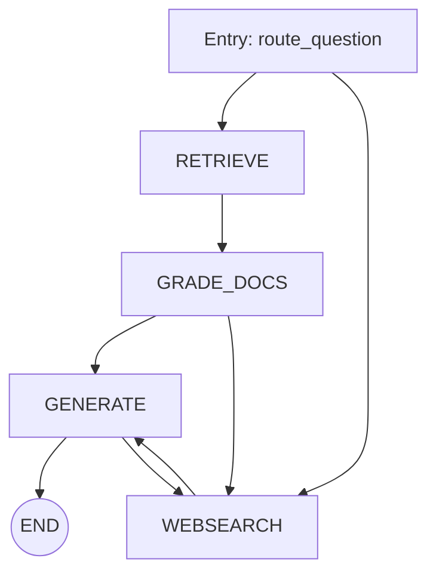

`graph/` — README.md

````md
# graph — Architecture, Contracts & Usage

**Purpose**

The `graph/` folder contains the LangGraph `StateGraph` definition and the top-level orchestration for the Advanced RAG Pipeline. This README documents the high-level architecture, the shared `GraphState` contract, how to compile/run the graph, and engineering notes for maintainability and extensibility.

---

## Contents
- `graph.py` — Graph definition (nodes, edges, conditional entry/edges) and compilation (`app = workflow.compile()`).
- `state.py` — `GraphState` TypedDict: canonical state schema passed between nodes.
- `node_constants.py` — canonical node name constants (e.g. `RETRIEVE`, `GENERATE`, `WEBSEARCH`, `GRADE_DOCUMENTS`).

---

## Abstract / Motivation

The `graph` layer defines the **control flow** for a resilient RAG pipeline. The design objective is to express conditional branching (routing), local correctness checks (grading), and corrective loops (re‑retrieve / re‑generate) as first-class graph semantics. Expressing this logic in LangGraph makes orchestration explicit and testable.

---

## GraphState (canonical contract)

The graph relies on a small, stable shared state. Update this TypedDict carefully; nodes depend on the field names and types.

```python
# graph/state.py
from typing import List, TypedDict
from langchain.schema import Document

class GraphState(TypedDict):
    question: str
    generation: str
    web_search: bool
    documents: List[Document]
````

**Guidelines**

* `documents` should be a list of `langchain.schema.Document` objects (include `metadata` where possible).
* Mutate only the fields your node is responsible for; return the minimal set of updated fields.

---

## How to compile & run (developer quick-start)

1. Ensure environment variables are set in `.env` and a Chroma index exists (run `ingestion.py` first).

2. From the repository root you may run the graph directly:

```bash
python -c "from graph.graph import app; print(app.invoke(input={'question':'What is Automatic Prompt Design?'}))"
```

3. The public `app` object exposes `invoke(input: Dict)` where `input` must minimally include `question`.

---

## High-level design summary

* **Entry routing** is implemented as a conditional entry point (router chain) that maps a question to either `RETRIEVE` or `WEBSEARCH`.
* **Retrieval path**: `RETRIEVE -> GRADE_DOCUMENTS` and then conditional branching to `GENERATE` or `WEBSEARCH`.
* **Generation path**: `GENERATE` is followed by post-generation graders (hallucination and helpfulness). Graders return values that determine whether to `END`, `RETRY GENERATE`, or go to `WEBSEARCH`.

Mermaid-ready high-level (kept small to avoid renderer issues):



---

## Developer notes & recommendations

* **Type safety**: change `state.py` to import and use `Document` from LangChain for clarity and lint support.
* **Config-driven retriever**: avoid importing the `retriever` directly from `ingestion.py` inside node code. Instead expose a small factory or `app.config` injection for better testability.
* **Magic strings**: centralize decision strings (e.g. "useful", "not supported") as constants (or enums) to avoid typos across graders and graph condition functions.
* **Testing**: write unit tests for `route_question`, `decide_to_generate`, and `grade_generation_grounded_in_documents_and_question`. Mock chains to assert edge selection.

---

## Example: programmatic invocation (python)

```py
from graph.graph import app
res = app.invoke(input={'question':'What is Automatic Prompt Design?'})
print(res)
```

Expected top-level keys in the final state: `question`, `documents`, `generation`, and grader-derived meta (e.g. `web_search`).

---

## References

* See `graph/nodes/README.md` and `graph/chains/README.md` for node- and chain-level documentation.

````

---

# 2) `graph/chains/` — README.md

```md
# graph/chains — Router, Graders & Generation Chains

**Purpose**

This folder implements the modular LLM-based "chains" used by the graph: the router (topic classifier), retrieval grader, hallucination grader, answer grader, and the generation prompt chain. Each chain is implemented as a Runnable (LangChain Core) and returns a structured output model (Pydantic / BaseModel) for deterministic decisions.

---

## Files & responsibilities
- `router.py` — `question_router` chain; returns `RouteQuery(datasource: Literal['vectorstore','websearch'])`.
- `retrieval_grader.py` — `retrieval_grader` chain; returns `GradeDocuments(binary_score: 'yes'|'no')`.
- `hallucination_grader.py` — `hallucination_grader` chain; returns `GradeHallucinations(binary_score: bool)`.
- `answer_grader.py` — `answer_grader` chain; returns `GraderAnswer(binary_score: bool)`.
- `generation.py` — `generation_chain` (pulls `rlm/rag-prompt` from LangChain Hub, pipes into ChatOpenAI(temperature=0) and `StrOutputParser()`).

---

## Chain schemas (structured outputs)

All graders use **structured outputs** to produce deterministic, machine-friendly responses. The models are defined using Pydantic (or LangChain's pydantic v1 wrapper) and attached to an LLM via `with_structured_output`.

### Example: `Answer` grader model (answer_grader.py)
```py
class GraderAnswer(BaseModel):
    binary_score: bool = Field(description="Answer addresses the question, 'yes' or 'no'")
````

### Example: `Router` model (router.py)

```py
class RouteQuery(BaseModel):
    datasource: Literal['vectorstore','websearch']
```

---

## Prompt design & best practices

* **System prompts** are strict about the required output schema and format. Keep `temperature=0` for deterministic grading.
* **Instruction clarity**: graders should explicitly instruct the model to return only the allowed schema values (`yes`/`no` or boolean). Use `with_structured_output` to enforce parsing.
* **Token budgets**: for hallucination checks that compare generation to documents, pass a concise representation of documents (e.g., top-k passages) rather than full long text.

---

## Example usages (python)

Router example:

```py
from graph.chains.router import question_router
out = question_router.invoke({"question":"What is prompt engineering?"})
# out.datasource == 'vectorstore' or 'websearch'
```

Retrieval grader example:

```py
from graph.chains.retrieval_grader import retrieval_grader
res = retrieval_grader.invoke({"question": q, "document": doc_text})
# res.binary_score in {'yes','no'}
```

Generation chain example:

```py
from graph.chains.generation import generation_chain
answer = generation_chain.invoke({"context": passages, "question": q})
```

---

## Evaluation & thresholds

* For `retrieval_grader`, consider extending the binary scheme to a numeric score (0.0–1.0) if you want tunable thresholds; store threshold constants in `node_constants.py` or in a `config` module.
* Maintain a small evaluation harness that runs a set of annotated QA pairs through the full graph and records: precision\@k (retrieval), hallucination rate, answer accuracy (against gold answers).

---

## Testability & CI

* Mock `ChatOpenAI` or use a hermetic local LLM for unit tests. Use `monkeypatch` to patch chain `.invoke()` return values.
* Add a lightweight integration test that runs ingestion → graph → final state for one canonical query.

---

## Design notes

* Keep grader prompts minimal and schema-driven.
* Use LangChain tracing (`LANGCHAIN_TRACING_V2=true`) in debug builds only; redact secrets before sharing traces.

````

---

# 3) `graph/nodes/` — README.md

```md
# graph/nodes — Node Reference and I/O Contracts

**Purpose**

This folder contains the executable nodes (Python callables) orchestrated by the `graph` StateGraph. Each node is a function that accepts a `GraphState` dict and returns a dict containing the fields it updates. Nodes encapsulate concrete operations (retrieval, grading loop, web search enrichment, generation) and must adhere to the GraphState contract.

---

## Node interface convention

```py
# Contract
from typing import Dict, Any
from graph.state import GraphState

def node(state: GraphState) -> Dict[str, Any]:
    """Read values from state, perform action, and return updated fields."""
    # Example
    question = state['question']
    # return only updated keys
    return {"documents": documents, "web_search": False}
````

**Principles**

* **Minimal returns**: nodes should return only keys they change.
* **Pure transforms**: prefer not to mutate incoming `state` in-place; return a new dict.
* **Metadata**: enrich `Document.metadata` with provenance and `source` fields (e.g., `metadata['source'] = url`).

---

## Files & descriptions

* `__init__.py` — re-exports for `graph.graph` to import nodes simply.

* `retrieve.py` — fetches top-k documents from a configured Chroma retriever. Current implementation imports `retriever` from `ingestion.py`. Recommended: refactor to use DI (injection) or a factory to construct retrievers from configuration.

  **Input:** `question`
  **Output:** `documents: List[Document]`

* `grade_documents.py` — iterates retrieved documents; calls `retrieval_grader` on each `document.page_content`. Appends only those graded as relevant and sets `web_search=True` if any document is not relevant.

  **Input:** `question`, `documents`
  **Output:** `documents` (filtered), `web_search` (bool)

* `web_search.py` — queries `TavilySearchResults(k=3)` and appends results to `documents`. Current implementation joins results into one `Document` object; **recommendation**: keep each search result as a separate `Document` with `metadata['source']`.

  **Input:** `question`, `documents?`
  **Output:** `documents` (enriched)

* `generate.py` — runs `generation_chain.invoke({"context": documents, "question": question})` and returns `generation`.

  **Input:** `question`, `documents`
  **Output:** `generation` (string)

---

## Implementation notes and best practices

* **Retriever injection**: provide a small `get_retriever(config)` in `ingestion.py` and call it from `retrieve.py` to avoid import/initialization order issues.
* **Document granularity**: store Tavily results as separate `Document` objects, not concatenated, to allow per-document grading and citation extraction.
* **Error handling**: all nodes that call external services (OpenAI, Tavily, Chroma) should catch transient errors and retry with exponential backoff (e.g., `tenacity` package).
* **Logging & tracing**: add structured logs (question id, step, timings) and include trace ids in `Document.metadata`.

---

## Example unit test for a node

```py
# tests/test_nodes.py
from graph.state import GraphState
from graph.nodes.generate import generate

class DummyChain:
    def invoke(self, args):
        return "dummy-answer"

# monkeypatch generation_chain to dummy

def test_generate_contract(monkeypatch):
    monkeypatch.setattr('graph.chains.generation.generation_chain', DummyChain())
    state: GraphState = {"question":"q","generation":"","web_search":False,"documents":[]}
    out = generate(state)
    assert isinstance(out['generation'], str)
```

---

## Maintenance checklist

* Keep node docs synchronized with actual code (update README when signature or return fields change).
* Review `Document.metadata` conventions and document them in `graph/README.md` (e.g. `{'source','score','retriever_id'}`).
* Add a small smoke test in CI which runs a mocked end-to-end flow.

```

---

**End of folder README templates.**

If you want, I can now:
1. Create these three `README.md` files directly in your repository (prepare commit patches), or
2. Provide a shell script that writes these files in PyCharm using a single copy-paste.

Which option would you like? If you'd like the files committed, tell me: commit message to use and the target branch (default `main`).

```
